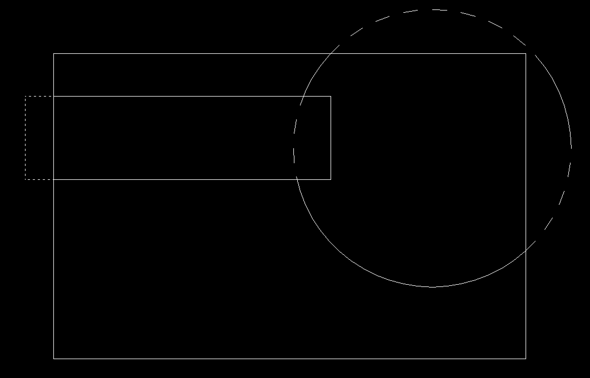

<b>Intersection of polygons</b>

This project is an example of <i>cohan-sutherland line clipping alghorithm</i> usage.

You can see the result on screenshot below.

<b>P.S.</b> V.1.0. has bug on corner points, will be fixed in next versions.

